# Discord Onboarding 'Interested In' Flow

```mermaid
flowchart LR
    Start([Start]) --> Join[User Joins Discord Server]
    Join --> Navigate[User Navigates to<br/>'Start Here' Channel]
    Navigate --> Read[User Reads Documentation]
    Read --> Channels[User Goes to<br/>Channels & Roles Tab]
    Channels --> SelectTeam[User Selects Team<br/>They Are Interested In]
    SelectTeam --> EventFired[Event is Fired<br/>for the Bot to Handle. Roles are attached to User]
    EventFired --> CreateThread[Bot Creates Welcome Thread<br/>in Entrance Channel]
    CreateThread --> End([End])
    
    style Start fill:#4caf50,stroke:#2e7d32,stroke-width:3px,color:#fff
    style End fill:#4caf50,stroke:#2e7d32,stroke-width:3px,color:#fff
```

## Notes
- A **private thread** is created in the entrance channel. Visibility is restricted to the user, Welcome Team, mods, and directors.
- There is a short delay after they select a team (configurable via `onboarding.delaySeconds`) to avoid misclicks and spam.
- Welcome threads are auto-closed after a configured period of inactivity (default 5 days) to reduce noise and stay under server thread caps.
- A standard welcome message is sent in the thread; someone from the Welcome Team will introduce themselves there.
